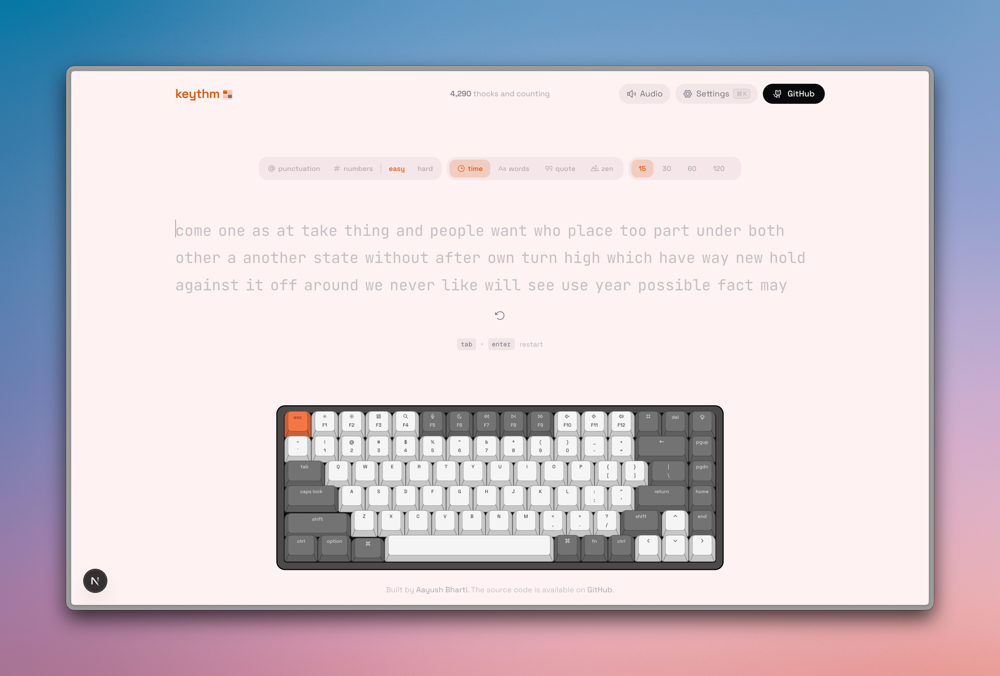

<a name="readme-top"></a>



<p align="center">
  <h3 align="center">Clavis</h3>
  <p align="center">
    A free typing test with realistic mechanical keyboard sounds
    <br />
    <a href="#features"><strong>Explore the features »</strong></a>
    <br />
    <br />
    <a href="#getting-started">Getting Started</a>
    &middot;
    <a href="#tech-stack">Tech Stack</a>
    &middot;
    <a href="#contributing">Contributing</a>
  </p>
</p>

<p align="center">
  <a href="https://github.com/T0b0i7/Clavis/stargazers">
    
  </a>
  <a href="https://github.com/T0b0i7/Clavis/forks">
    
  </a>
  <a href="https://github.com/T0b0i7/Clavis/blob/main/LICENSE">
    
  </a>
  <a href="https://www.typescriptlang.org/">
    
  </a>
  <a href="https://github.com/T0b0i7/Clavis/commits/main">
    
  </a>
  <a href="https://github.com/T0b0i7/Clavis/pulls">
    
  </a>
  
</p>

<details>
<summary>Table of Contents</summary>

- [About](#about)
- [Features](#-features)
- [Tech Stack](#-tech-stack)
- [Getting Started](#-getting-started)
- [Scripts](#-scripts)
- [Recent Improvements](#-recent-improvements)
- [Contributing](#-contributing)
- [Deployment](#-deployment)

</details>

## About

**Clavis** is a free online typing test with **realistic mechanical keyboard sounds** and real-time WPM tracking. Practice with timed tests, word counts, quotes, or zen mode — featuring an interactive on-screen keyboard, satisfying key sounds, and detailed accuracy stats.

The audio feedback system uses real mechanical keyboard samples triggered via the Web Audio API, creating an immersive typing experience that rivals physical keyboards. Every keystroke, space, and backspace produces authentic switch sounds that can be customized through multiple keyboard themes.

## ✨ Features

| Area | What you get |
|------|----------------|
| **Test modes** | Time (15s–120s), word count, quotes (length presets), zen |
| **Mechanical key sounds** | Realistic per-key audio feedback via Web Audio API; multiple keyboard themes with distinct sound profiles |
| **Virtual keyboard** | Interactive on-screen keyboard with 3D CSS rendering — highlights keys as you type, shows pressed state with realistic depth animation |
| **Results** | WPM, raw speed, accuracy, character breakdown, consistency, elapsed time, WPM-over-time chart (Recharts) |
| **Keyboard themes** | 6 color schemes — Classic, Mint, Royal, Dolch, Sand, Scarlet — each tints the entire UI and keyboard |
| **Typing fonts** | 9 fonts — Geist Mono, JetBrains Mono, Fira Code, IBM Plex Mono, Source Code Pro, Inter Tight, Space Grotesk, Nunito, Atkinson Hyperlegible |
| **Settings** | Theme (light/dark/system), accent color, font picker, show keyboard, sound volume, live WPM, ghost mode, Faah mode |
| **Haptics** | Optional vibration feedback on supported hardware via Web Haptics API |
| **Anti-cheat** | 10+ validation checks detecting auto-typers, macros, AFK, and impossible stats |
| **PWA** | Installable as a Progressive Web App — works offline with service worker |
| **Keyboard shortcuts** | `R` to restart, `Esc` to unfocus, `Tab+Enter` restart combo |
| **Export** | Download results as JSON or CSV |

Settings persist in `localStorage`. Personal bests are tracked per mode and displayed on each result.

## 🛠 Tech Stack

<details><summary><b>Clavis</b> is built using the following technologies:</summary>

- [TypeScript](https://www.typescriptlang.org/): Typed superset of JavaScript.
- [Next.js](https://nextjs.org/) 16: React framework with App Router.
- [React](https://react.dev/) 19: UI library.
- [Tailwind CSS](https://tailwindcss.com/): Utility-first CSS framework.
- [Base UI](https://base-ui.com/): Unstyled, accessible component primitives from MUI.
- [shadcn/ui](https://ui.shadcn.com/): Pre-styled component recipes.
- [Motion](https://motion.dev/): Animation library for React (FLIP cursor transitions, spring physics).
- [Recharts](https://recharts.org/): Composable charting library for WPM-over-time graphs.
- [Drizzle ORM](https://orm.drizzle.team/) + Turso (LibSQL): Type-safe database layer for visit tracking.
- [Biome](https://biomejs.dev/): Fast linter and formatter.
- [Serwist](https://serwist.pages.dev/): PWA / service worker toolkit.
- [Vitest](https://vitest.dev/): Unit testing framework.
- [Vercel](https://vercel.com/): Deployment platform.

</details><br/>

[](https://aayushbharti.in)

## 🧰 Getting Started

1. Make sure [Git](https://git-scm.com/downloads) and [Bun](https://bun.sh/) (or Node.js 20+) are installed.
2. Fork this repository and clone your fork:

   ```bash
   git clone https://github.com/<your-username>/clavis.git
   cd clavis
   ```

3. Install dependencies and start the dev server:

   ```bash
   bun install
   bun dev
   ```

4. Open [http://localhost:3000](http://localhost:3000) in your browser.

## 📜 Scripts

| Command | Description |
|---------|-------------|
| `bun dev` | Development server |
| `bun run build` | Optimized production build |
| `bun start` | Serve the production build |
| `bun run lint` | Lint with Biome |
| `bun run lint:fix` | Lint and auto-fix with Biome |
| `bun run format` | Format with Biome |
| `bun run typecheck` | Type-check with TypeScript |
| `bun test` | Run unit tests (Vitest) |
| `bun run test:watch` | Run tests in watch mode |

## 🔧 Recent Improvements

The following enhancements have been applied to the project:

### Bug Fixes
- **React 19 safety**: `frozenStatsRef` computation moved from inline render to a `useEffect` — prevents side effects during render which could cause issues with React 19 concurrent features
- **Audio deduplication**: Fixed `KeyV` and `KeyC` sharing the same audio sample offset — each key now has a unique sound
- **Quotes data cleanup**: Corrected 10 malformed quotations where the author field contained text fragments instead of attribution names; fixed spelling errors

### Code Quality
- **Hook dependencies**: Secured the mount `useEffect` with a `initialisedRef` guard and extracted default constants — eliminates stale closure warnings
- **Dead code removal**: Removed `handleKeyHighlight` no-op callback that was passed through 3 components without any effect
- **TypeScript target**: Updated `tsconfig.json` from `ES2017` to `ES2022` — properly aligned with Next.js 16 and React 19
- **Test suite**: Added Vitest with 26 unit tests covering anti-cheat validation (17 tests) and WPM counting logic (9 tests)

### New Features
- **Keyboard shortcuts**: Press `R` to restart a test, `Esc` to unfocus the input — displayed directly in the UI
- **Test commands**: `npm test` and `npm run test:watch` added to package.json

### Project Structure
```
src/
├── app/              # Pages, layout, SEO, service worker
├── components/
│   ├── layout/       # App chrome (header/footer)
│   ├── settings/     # Settings drawer, font picker, theme picker
│   ├── theme/        # Theme provider, dynamic favicon
│   ├── typing/       # Core typing test, word items, results, controls
│   └── ui/           # Keyboard, drawer, chart, confetti, slider
├── data/             # Quotes database
├── hooks/            # useTypingTest (main logic), useMediaQuery
├── lib/              # Types, utils, audio, words, WPM, validation, DB
└── public/           # Sounds, images, service worker, languages
```

## 🔧 Contributing

Contributions are what make the open source community such an amazing place to learn, inspire, and create. Any contributions you make are **greatly appreciated**.

1. Fork the repo
2. Create a new branch (`git checkout -b improve-feature`)
3. Make the appropriate changes in the files
4. Commit your changes (`git commit -am 'Improve feature'`)
5. Push to the branch (`git push origin improve-feature`)
6. Create a Pull Request

## 📃 Deployment

| Method | Description | Action |
|--------|-------------|--------|
| **🔧 Manual Build** | Create an optimized production build. | `bun run build` |
| **▲ Vercel (Recommended)** | Deploy instantly on the Vercel platform. | [](https://vercel.com/new/clone?repository-url=https%3A%2F%2Fgithub.com%2FT0b0i7%2FClavis) |
| **🌐 Netlify** | Deploy easily on Netlify. | [](https://app.netlify.com/start/deploy?repository=https://github.com/T0b0i7/Clavis) |

For more details, check the [Next.js deployment docs](https://nextjs.org/docs/deployment).

<br />
<p align="right">(<a href="#readme-top">back to top</a>)</p>
