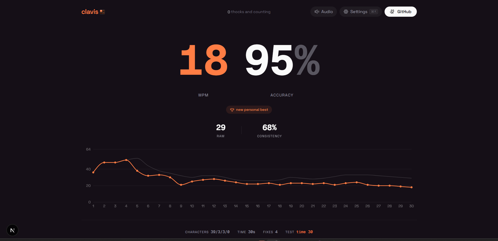
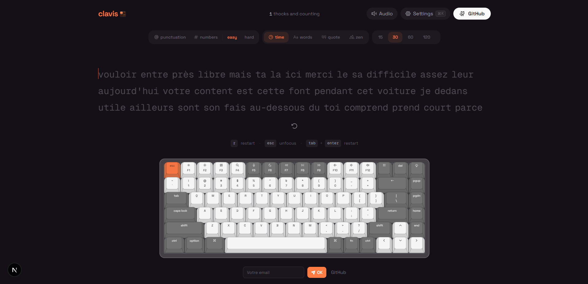
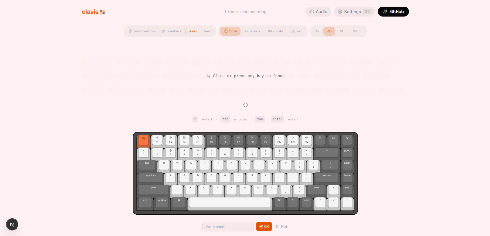
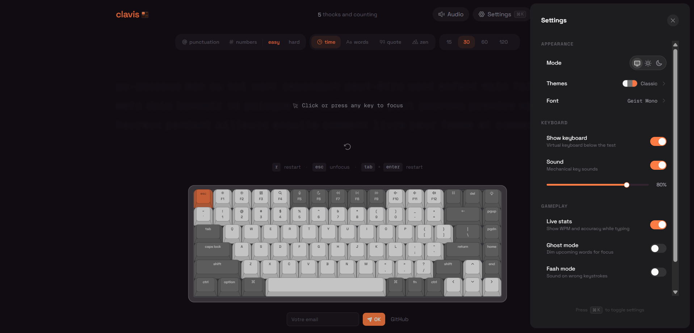
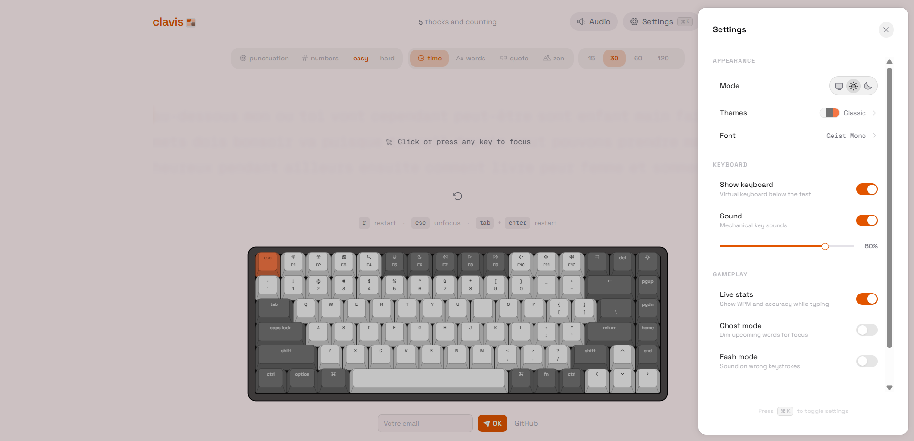

<a name="readme-top"></a>

<div align="center">
  
  <br/><br/>
  
  
  
  
  
</div>

<br/>

> **🚨 RÈGLE ABSOLUE — LIS AVANT DE CLONER OU TÉLÉCHARGER**
>
> Ce projet est protégé par une **licence conditionnelle**. En clonant, téléchargeant ou utilisant ce code, tu acceptes automatiquement les termes suivants :
>
> 1. **Tu dois ⭐ mettre une étoile (star)** sur le repository GitHub **AVANT** de cloner, télécharger ou utiliser le projet.
> 2. **Pas de star = pas de licence** → tu n'as pas le droit d'utiliser, copier, modifier ou distribuer ce code.
> 3. **Cette condition est irrévocable** et s'applique à tout utilisateur, développeur ou organisation.
>
> 👉 **https://github.com/T0b0i7/Clavis** ← va mettre ta star **MAINTENANT** avant de continuer.

<p align="center">
  <h3 align="center">Clavis</h3>
  <p align="center">
    Un test de dactylographie immersif avec de **vrais sons de clavier mécanique**
    <br />
    Créé par <strong>Eucher O. ABATTI (T0b0i7)</strong> — © 2026. Tous droits réservés.
    <br />
    <br />
    <a href="#features"><strong>Explorer les fonctionnalités »</strong></a>
    <br/>
    <a href="https://clavis-azure.vercel.app">🌐 Site live</a>
    &middot;
    <a href="https://github.com/T0b0i7/Clavis">💻 GitHub</a>
    <br/>
    <br/>
    <strong>💻 Pour une expérience optimale, utilise un PC (ordinateur) —</strong> le clavier virtuel et les sons mécaniques sont conçus pour une utilisation sur desktop.
    <br/>
    <a href="https://clavis-azure.vercel.app"><strong>👉 Essaie-le sur ton PC</strong></a>
  </p>
</p>

<p align="center">
  <a href="https://github.com/T0b0i7/Clavis/stargazers">
    
  </a>
  <a href="https://clavis-azure.vercel.app/api/downloads">
    
  </a>
  <a href="https://github.com/T0b0i7/Clavis/forks">
    
  </a>
  <a href="https://github.com/T0b0i7/Clavis/blob/main/LICENSE">
    
  </a>
  <a href="https://www.typescriptlang.org/">
    
  </a>
  <a href="https://github.com/T0b0i7/Clavis/commits/main">
    
  </a>
  <a href="https://github.com/T0b0i7/Clavis/pulls">
    
  </a>
  
</p>

<p align="center">
  <a href="https://clavis-azure.vercel.app/download">
    
  </a>
  <br/>
  <sub>⬆️ Le compteur s'incrémente automatiquement à chaque clic</sub>
</p>

<details>
<summary>Table of Contents</summary>

- [About](#about)
- [Features](#-features)
- [Tech Stack](#-tech-stack)
- [Getting Started](#-getting-started)
- [Scripts](#-scripts)
- [Recent Improvements](#-recent-improvements)
- [Contributing](#-contributing)
- [Deployment](#-deployment)

</details>

## About

**Clavis** is a free online typing test with **realistic mechanical keyboard sounds** and real-time WPM tracking. Practice with timed tests, word counts, quotes, or zen mode — featuring an interactive on-screen keyboard, satisfying key sounds, and detailed accuracy stats.

The audio feedback system uses real mechanical keyboard samples triggered via the Web Audio API, creating an immersive typing experience that rivals physical keyboards. Every keystroke, space, and backspace produces authentic switch sounds that can be customized through multiple keyboard themes.

## ✨ Features

| Area | What you get |
|------|----------------|
| **Test modes** | Time (15s–120s), word count, quotes (length presets), zen |
| **Mechanical key sounds** | Realistic per-key audio feedback via Web Audio API; multiple keyboard themes with distinct sound profiles |
| **Virtual keyboard** | Interactive on-screen keyboard with 3D CSS rendering — highlights keys as you type, shows pressed state with realistic depth animation |
| **Results** | WPM, raw speed, accuracy, character breakdown, consistency, elapsed time, WPM-over-time chart (Recharts) |
| **Keyboard themes** | 6 color schemes — Classic, Mint, Royal, Dolch, Sand, Scarlet — each tints the entire UI and keyboard |
| **Typing fonts** | 9 fonts — Geist Mono, JetBrains Mono, Fira Code, IBM Plex Mono, Source Code Pro, Inter Tight, Space Grotesk, Nunito, Atkinson Hyperlegible |
| **Settings** | Theme (light/dark/system), accent color, font picker, show keyboard, sound volume, live WPM, ghost mode, Faah mode |
| **Haptics** | Optional vibration feedback on supported hardware via Web Haptics API |
| **Anti-cheat** | 10+ validation checks detecting auto-typers, macros, AFK, and impossible stats |
| **PWA** | Installable as a Progressive Web App — works offline with service worker |
| **Keyboard shortcuts** | `R` to restart, `Esc` to unfocus, `Tab+Enter` restart combo |
| **Export** | Download results as JSON or CSV |

Settings persist in `localStorage`. Personal bests are tracked per mode and displayed on each result.

## 🛠 Tech Stack

<details><summary><b>Clavis</b> is built using the following technologies:</summary>

- [TypeScript](https://www.typescriptlang.org/): Typed superset of JavaScript.
- [Next.js](https://nextjs.org/) 16: React framework with App Router.
- [React](https://react.dev/) 19: UI library.
- [Tailwind CSS](https://tailwindcss.com/): Utility-first CSS framework.
- [Base UI](https://base-ui.com/): Unstyled, accessible component primitives from MUI.
- [shadcn/ui](https://ui.shadcn.com/): Pre-styled component recipes.
- [Motion](https://motion.dev/): Animation library for React (FLIP cursor transitions, spring physics).
- [Recharts](https://recharts.org/): Composable charting library for WPM-over-time graphs.
- [Drizzle ORM](https://orm.drizzle.team/) + [Turso](https://turso.tech/) (LibSQL): Type-safe cloud database for visit tracking and newsletter subscribers.
- [Resend](https://resend.com/): Email API for automated subscriber notifications.
- [Biome](https://biomejs.dev/): Fast linter and formatter.
- [Serwist](https://serwist.pages.dev/): PWA / service worker toolkit.
- [Vitest](https://vitest.dev/): Unit testing framework.
- [Vercel](https://vercel.com/) / [Netlify](https://netlify.com/): Deployment platforms.

</details><br/>

[](https://aayushbharti.in)

## 🧰 Getting Started

1. Make sure [Git](https://git-scm.com/downloads) and [Bun](https://bun.sh/) (or Node.js 20+) are installed.
2. Fork this repository and clone your fork:

   ```bash
   git clone https://github.com/<your-username>/clavis.git
   cd clavis
   ```

3. Install dependencies and start the dev server:

   ```bash
   bun install
   bun dev
   ```

4. Open [http://localhost:3000](http://localhost:3000) in your browser.

## 📜 Scripts

| Command | Description |
|---------|-------------|
| `bun dev` | Development server |
| `bun run build` | Optimized production build |
| `bun start` | Serve the production build |
| `bun run lint` | Lint with Biome |
| `bun run lint:fix` | Lint and auto-fix with Biome |
| `bun run format` | Format with Biome |
| `bun run typecheck` | Type-check with TypeScript |
| `bun test` | Run unit tests (Vitest) |
| `bun run test:watch` | Run tests in watch mode |
| `npm run db:generate` | Generate a Drizzle migration after schema changes |
| `npm run db:push` | Push schema to Turso database |
| `npm run db:studio` | Open Drizzle Studio (web UI) |

## 🔧 Recent Improvements

The following enhancements have been applied to the project:

### Bug Fixes
- **React 19 safety**: `frozenStatsRef` computation moved from inline render to a `useEffect` — prevents side effects during render which could cause issues with React 19 concurrent features
- **Audio deduplication**: Fixed `KeyV` and `KeyC` sharing the same audio sample offset — each key now has a unique sound
- **Quotes data cleanup**: Corrected 10 malformed quotations where the author field contained text fragments instead of attribution names; fixed spelling errors

### Code Quality
- **Hook dependencies**: Secured the mount `useEffect` with a `initialisedRef` guard and extracted default constants — eliminates stale closure warnings
- **Dead code removal**: Removed `handleKeyHighlight` no-op callback that was passed through 3 components without any effect
- **TypeScript target**: Updated `tsconfig.json` from `ES2017` to `ES2022` — properly aligned with Next.js 16 and React 19
- **Test suite**: Added Vitest with 26 unit tests covering anti-cheat validation (17 tests) and WPM counting logic (9 tests)

### New Features
- **Keyboard shortcuts**: Press `R` to restart a test, `Esc` to unfocus the input — displayed directly in the UI
- **Test commands**: `npm test` and `npm run test:watch` added to package.json

### Newsletter & Database
- **Turso cloud database**: Visit counter and newsletter subscribers now stored in a remote Turso (LibSQL) database via Drizzle ORM
- **Newsletter API**: `POST /api/newsletter` for subscriptions (validation + anti-doublon), `GET /api/newsletter?key=...` for admin listing
- **Auto-notifications**: `POST /api/newsletter/notify?key=...` sends emails to all subscribers via Resend
- **GitHub Action**: Automatic subscriber notifications on every `push main` — configurable via `DEPLOY_URL` and `NOTIFICATION_KEY` secrets
- **Database optional**: If `DATABASE_URL` is not set, the app gracefully falls back without crashing

### Project Structure
```
src/
├── app/              # Pages, layout, SEO, service worker, API routes
├── components/
│   ├── layout/       # App chrome (header/footer)
│   ├── settings/     # Settings drawer, font picker, theme picker
│   ├── theme/        # Theme provider, dynamic favicon
│   ├── typing/       # Core typing test, word items, results, controls
│   └── ui/           # Keyboard, drawer, chart, confetti, slider
├── data/             # Quotes database
├── hooks/            # useTypingTest (main logic), useMediaQuery
├── lib/              # Types, utils, audio, words, WPM, validation, DB
├── drizzle/          # Database migrations
├── .github/          # GitHub Actions workflows
└── public/           # Sounds, images, service worker, languages
```

## 🔧 Contributing

Contributions are what make the open source community such an amazing place to learn, inspire, and create. Any contributions you make are **greatly appreciated**.

1. Fork the repo
2. Create a new branch (`git checkout -b improve-feature`)
3. Make the appropriate changes in the files
4. Commit your changes (`git commit -am 'Improve feature'`)
5. Push to the branch (`git push origin improve-feature`)
6. Create a Pull Request

## 📃 Deployment

| Method | Description | Action |
|--------|-------------|--------|
| **🔧 Manual Build** | Create an optimized production build. | `bun run build` |
| **▲ Vercel (Recommended)** | Deploy instantly on the Vercel platform. | [](https://vercel.com/new/clone?repository-url=https%3A%2F%2Fgithub.com%2FT0b0i7%2FClavis) |
| **🌐 Netlify** | Deploy easily on Netlify. | [](https://app.netlify.com/start/deploy?repository=https://github.com/T0b0i7/Clavis) |

### Required Environment Variables

When deploying, set these in your platform dashboard (Vercel / Netlify):

| Variable | Description |
|----------|-------------|
| `DATABASE_URL` | Turso database URL (`libsql://...`) |
| `DATABASE_AUTH_TOKEN` | Turso authentication token |
| `RESEND_API_KEY` | Resend API key for email notifications |
| `NOTIFICATION_KEY` | Secret key to protect the notify endpoint |

For GitHub Actions auto-notifications, also set these **repository secrets**:
- `DEPLOY_URL` — your deployed site URL
- `NOTIFICATION_KEY` — same key as above

For more details, check the [Next.js deployment docs](https://nextjs.org/docs/deployment).

<br/>

---

## ❓ FAQ

### 📜 Quelle est la licence du projet ?

Clavis utilise une **licence conditionnelle personnalisée**. Ce n'est **pas du MIT**. Le code est open source et visible publiquement, mais pour l'utiliser, le cloner ou le télécharger, tu dois d'abord ⭐ **mettre une étoile (star)** sur le repository GitHub. Pas de star = pas de licence d'utilisation.

C'est une façon simple de soutenir le projet et de mesurer l'intérêt de la communauté 🙏

### 🤝 Puis-je contribuer / collaborer ?

**Oui, absolument !** Les contributions sont les bienvenues. Tu peux :
1. ⭐ Mettre une star sur le repository
2. Forker le projet
3. Faire tes modifications
4. Soumettre une **Pull Request** — je l'examinerai avec plaisir

Le code est ouvert à l'amélioration collective !

### 🎨 Les thèmes ont été créés ou importés ? C'est du Tailwind ?

Les **6 thèmes** (Classic, Mint, Royal, Dolch, Sand, Scarlet) ont été **créés directement dans le code** — ce ne sont pas des imports externes. Chaque thème utilise des **couleurs OKLCH** (format moderne plus précis que RGB/HSL) et modifie toute l'interface : clavier virtuel 3D, boutons, accents, texte. Ils sont gérés via des variables CSS personnalisées avec un attribut `data-accent`.

**Et oui, c'est du Tailwind CSS v4 !** Toute la mise en page utilise Tailwind, combiné à des animations CSS personnalisées. Le rendu 3D du clavier est fait en **CSS pur** avec `transform: perspective()` et des ombres — pas de Three.js.

Pour les sons mécaniques, c'est du **Web Audio API** en JavaScript pur avec des échantillons audio réels de switches mécaniques. Chaque touche a son propre son unique 🎧

<br />
<p align="right">(<a href="#readme-top">back to top</a>)</p>
